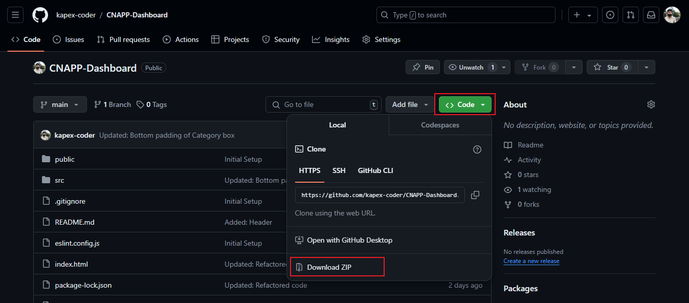

# Dynamic Dashboard/Widget System

This project is a dynamic dashboard built with React and Material UI (MUI), leveraging Redux for state management. The dashboard is structured using a JSON object that organizes widgets into various categories. Users can dynamically add, remove, and search for widgets within these categories. Each widget can be customized with a name and text. The application provides an intuitive interface for managing widgets, ensuring a smooth user experience.

***Live site URL :*** [https://kapex-cnapp-dashboard.vercel.app/](https://kapex-cnapp-dashboard.vercel.app/){:target="_blank"} 

## Steps to run locally

### Steps by Clone
- Open a terminal

- Clone the repository using the following command: `git clone https://github.com/kapex-coder/CNAPP-Dashboard.git`

- Navigate to the project directory `cd CNAPP-Dashboard`

- Run `npm install` to install dependencies.

- Run `npm run dev` to start the application.

### Steps by downloading ZIP file
- Go to project repository [https://github.com/kapex-coder/CNAPP-Dashboard](https://github.com/kapex-coder/CNAPP-Dashboard)

- Download ZIP file by clicking on `Code` then `Download ZIP`

  

- Open project in any editor.

- Run `npm install` to install dependencies in terminal.

- Run `npm run dev` to start the application.
